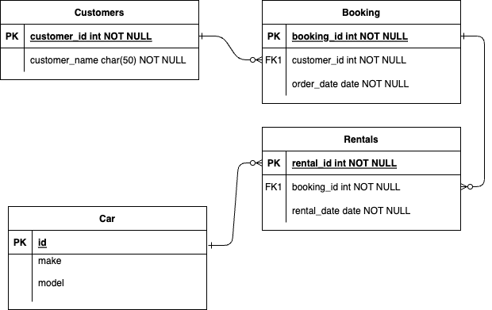

# car rental

## my notes

https://github.com/tiggus/car-rental

local in git\car-rental

this one was found via search, cloned and checks for anything malicious

unittest amended to print cost criteria (60) (999) etc - run direct via CarRentalTest.py


https://github.com/tiggus/car-rental-python/blob/main/story1.py

https://github.com/tiggus/python

working/car-rental.py - BMW in parameters (Criteria class - def make_criteria)
classes.py -> returns classes, to be expanded for params / vars
basic.py -> scratch / test file

unittest -> python -m unittest CarRentalTest.py

../car-rental-booking/CarRentalTest.py - booking with from date
../car-rental-booking/story1.py - prompts for input BMW for example - no error handling


### production

- security

- automated unit and sec tests (whitesource, checkov)

- logging, monitoring

- return car to pool

- maintain pool

- database

- frontend, app server

- source control / approvals for moving code between envs

- mutiple envs

- redundancy

- secrets 

- immutable params

- seperation of duties

### discussion points

> data model: https://vertabelo.com/blog/renting-out-cars-is-as-simple-as-driving-a-data-model-for-a-car-rental-company/

> hosting

> do we start with a basic gui / input and results

> whats existing, whens it needed, budget 

> regular feedback -> inc costs 

> ovelapping efficiency, start with a DB for story 1 as it will be needed later

## Assessor

Assessor to "role play" the following script:

"During this exercise I am going to play the part of a car rental firm owner. As the car rental firm owner, I don't know anything about technology, however I do know what I need. I have a set of requirements in the form of stories which we will implement one at a time. Once we're happy that a story is complete, we'll move onto the next story. We have quite a few stories, but the whole exercise will be capped at 1 hour.
This is not a race, we'll just get as far as we get in that time. You can ask me any questions you want about the requirements and scenarios. I will occasionally ask you questions about your solution (but not as the car rental owner), to help me understand your solution and or thinking. It is not important to implement all corner cases, however it is important to show there are things you might have considered if this was "production" code, and we can talk about those and decide whether to implement or not."


## Story 1 - finding a car to rent

As a car rental company I want to match a potential renter to a car that I have to rent...
...So that I can give a list of cars to a potential client.

acceptance criteria: one method returning a list of matching cars
design criteria: the method should be threadsafe (allowing it to be called from multiple threads)

---

### tech solution

- new class: CarRentalTest to create list of four cars

- threading imported and self lock added to list creation

- rental_company defined to use CarRentalTest class

- search on make configured and set to one make.

---

### business solution

- list of four cars

- ability to return results based on make, model, type etc

> We can add a gui for both the front end and the results

## Story 2 - finding an available car to be rented

As a car renter I want to know if a car is available to be rented on the dates I need...
...So that i can provide a list of cars that are available on the dates given by the renter

acceptance criteria: the matching criteria for a renter to rent a car should include a from date and to date
acceptance criteria: the car renter should not be shown any cars that are booked in the period that is supplied
acceptance criteria: one method returning a list of matching cars (with the filter having changed) 
design criteria: the method should be threadsafe (allowing it to be called from multiple threads)

---

### tech solution

- Import date from datetime

- Add parameters (list) to each car to store a booking to and from date

- Add variables for required to and from date to the call

- threadsafe check list for avaialble cars matching all criteria, return results filtered to only show cars that are available (if dateFrom to != etc)

```python
Car("Toyota", "RAV4", "NHK 337P", "B2", 90, ['datefrom:dateto','datefrom:dateto']),
```

---

### business solution

- Show to ability to list all cars based on dates, then to further filter based on other parameters (make, model)

- Consider a method to hold a car for a period of time should the customer wish to book, reserve this care > starts timer

- Consider a method to return other options should the parameters not be met, no class A, we can offer Class B at a discount ?

## Story 3 - booking a car

As a car renter I want to book a car which has been shown to me as being available...
...So that I can have a car available to me to use during the rental period

acceptance criteria: the car rental should be stored in an object model
acceptance criteria: there should not be able to have overlapping car rentals for the same car
acceptance criteria: two renters should not be able to book the same car at the same time for an overlapping period
acceptance criteria: one method allowing the car renter to book a car for a period
design criteria: the in memory storage should consider threadsafety, all access to and from it should therefore be threadsafe

---

### tech solution

- Store as an object model, define data types: [integer, date time, str]; regex, data vaildation a@b.com

- all required classes to implelement threadsafety to required operations

- search and return the list of cars avaialble and implement a lock on all results (List, file, db?)

- choose / select a car, add a parameter 'lock' to the desired car with a unique transaction ID and start a transaction timer <15 mins?>

- release the lock on all to allow other bookings to commence

- For the unique transation ID complete or abort the booking process

    - complete the process adds the new dates to the specific cars [bookings]

    - abort the process removes the transacation ID from the inflight booking and exits



> Time for a GUI, DB (node, react, postgres)
> show giu - thinkter and IDLE

---

### business solution

- Show the results

- Discuss the benefits of a GUI

- Discuss the requirments for and the benefits of a DB

- Discuss the expansion plans, multi site? how many booking agents? channels (direct, web, app)

## Story 4 - car preparation

As a car rental company I need to understand what cars are coming up as new rentals on a specific date...
...So that I can make sure they are clean and ready to be rented

acceptance criteria: one method return all new rentals for the coming week ordered by date

acceptance criteria: the structure of the date returned should include the car model/make and it's registration as well as the date rented

---

### tech solution

- Provide reporting to group results based on upcoming dates

- Add parameters to pad return dates with a 'maintenance window', returned on A, maintenance window B, Available for new rental (A+B)

- Return summary - all rentals based on next weeks dates, include info on start and end dates

- Filter parameters to add the required data (car model, make)

---

### business solution

- How should results be returned for different parts of the business?

- Cleaning crew need to know mumber, type and reg of cars to valet on X day

- Mamnagement can then schedule crew members shifts

- Print list of cars to be valeted for valet crews to filter out restricted information (rental prices etc)

## Story 5 - car maintenance

As a car renter i need to be able to make a car unavailable for rental for a specific period...
...So that I can make repairs to a car or get it serviced

acceptance criteria: the car being out of service needs to be booked like a car rental (but see below)
acceptance criteria: if the car to be booked already has an existing booking then I should be able to move the booking to a new car of the same alpha car rental group (if any exists) - for example a group "A" car
acceptance criteria: i should be able to differentiate between a rental and service booking
design criteria: during any booking movement we need to avoid another renters being able to book the car that the booking is moving to 

---

### tech solution

- Add paramters to existing data storage to allow for services bookings (from and to date)

    - Consider adding extra parameters for bookinmg service (clean, repair, rental) 
    
    ```python 
    ['fromDate:toDate:rental','fromDate:toDate:service]
    ```

- Get alpha group, If car booked on date check other cars in group 

    - if free transfer booking to other car

    - else exception (consider process at this time to upgrade group / model)

        - define exception process in this instance

            - flag to rental agent

            - import cars from another location

- DB locks, threadsafe, session tokens

- Unique ID locking the car whilst transaction in progress as previous stories

---

### business solution

- Define the business parameters, locations, options to move cars, drop off and pick up (one location or many)

- Call of car to reflect service time, 4x4 may need longer than a saloon, VAN may need less

- What about times? Do we want to book the cars out to more than one customer each day ?

- Allow the customers to self book ?

## Story 6 - rental pricing

As a car rental company I want to show a blended price of all cars in the alpha part of the car rental group to a customer...
...So that I can manage individual car costs, but show a view at the group level

acceptance criteria: one method returning a list of matching cars which are available and which now includes a price

acceptance criteria: the booking method is updated to accept this new price which is stored alongside the booking information

### tech solution

- Code a management solution to get each alpha group and perform the math to show the blended rate
    - consider other parameters (age of car = more costly to maintain)

- Add the prices of the cars and divide by number of cars

- Schedule a daily backend run to get n cars, add p price, p%n, update all cars in class with new rate (p%n)

    - Store the price for each alpha and just use alpha group to retrieve

---

### business solution

- show the results

- discuss report options: data, frequency, audience

- store output iun DB to enable history, foreward planning

## future

DB, persistent storage, concurrency control (handle multiple simultaneous read and write operations etc), handle large volumes of data, scale with growing application requirements, indexing, caching, and query optimization techniques (to improve performance and reduce response times). 

Microservices: Modular and scalable architecture.
Real-time Data: Instant updates for users.
Machine Learning: Personalized experiences and predictive analytics.
Geolocation Services: Enhanced user navigation and location-based features.